# WordPress新手建站完全攻略：从零开始搭建你的第一个博客

---

看到别人精美的博客，你是不是也想拥有一个属于自己的网络空间？但技术门槛让很多人望而却步。其实，搭建一个WordPress博客并没有想象中那么难。这篇教程会手把手带你完成准备工作——选择云主机、注册域名、配置解析，以及连接服务器。只要会用电脑，跟着步骤走，你就能建起一个像模像样的个人博客。

---

## 第一步：选择并配置云主机

建站第一件事，就是要有个"家"——云主机（VPS）。它是网站的载体，所有文件都会存储在这里。

市面上的云主机供应商很多，比如Vultr、阿里云等。我当时选的是Vultr，原因很简单：性能稳定，客服全天在线，关键是价格不贵。👉 [如果你也想试试，可以从这里注册Vultr，新用户还能享受优惠](https://www.vultr.com/?ref=9738262-9J)。

### 注册并激活账号

首先注册账号，填好个人信息。需要注意的是，账号需要充值才能激活，可以用支付宝（Alipay）付款，很方便。

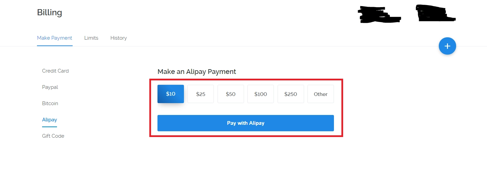

### 创建服务器

充值完成后，进入管理页面，点击右上角的蓝色加号，开始创建服务器。

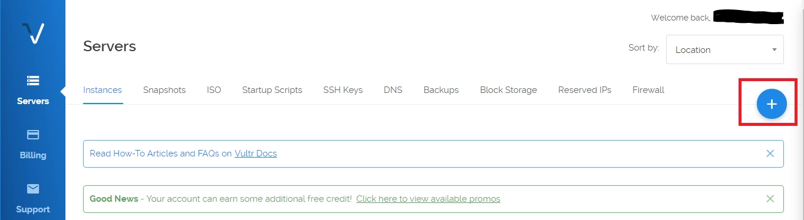

**选择服务器位置**

这一步要选择数据中心的地理位置。建议选新加坡（Singapore），因为日本节点的IP经常不可用。新加坡离国内近，速度也不错。

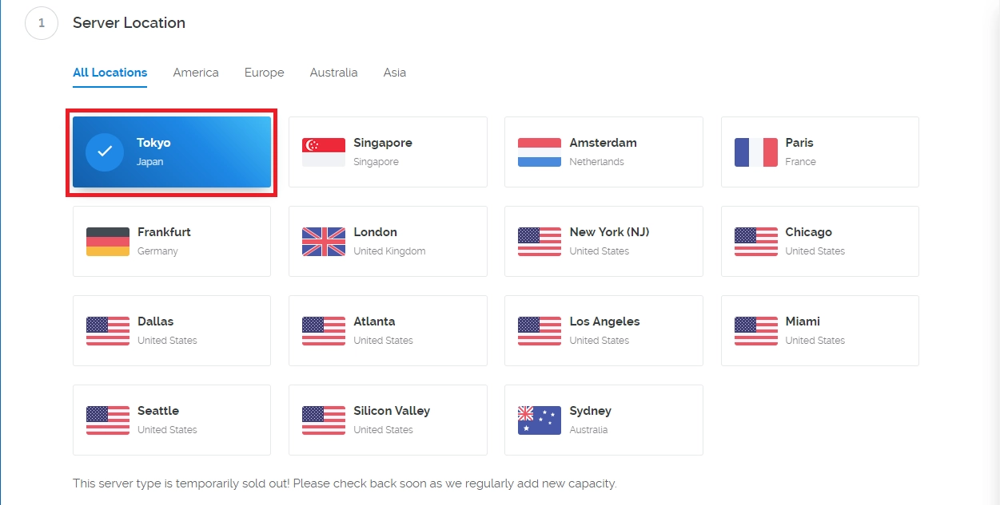

**选择操作系统和配置**

系统必须选CentOS 7 x64，后面的教程都基于这个系统展开。性能方面，月付5美元的套餐就够用了。如果预算充足，可以选更高配置。有个小提示：只有纽约和迈阿密有月付2.5美元的套餐，但对新手来说，5美元那档更稳定。

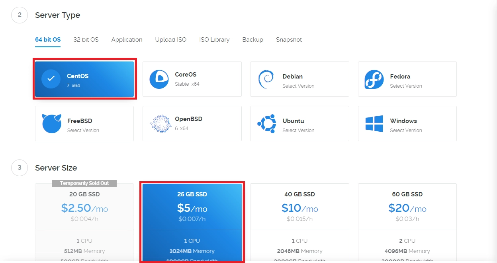

**完成创建**

往下可以选择自动备份（每月额外1美元），然后填写主机名称。需要注意，hostname创建后不可更改，除非重置服务器。点击"Deploy Now"完成创建。

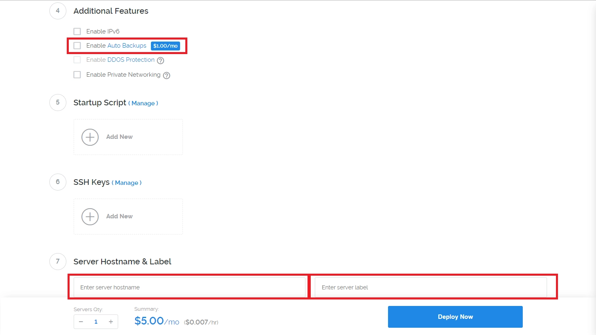

创建需要一点时间，完成后记下这三样东西：IP地址、root用户名、root密码。这些后面都要用到。

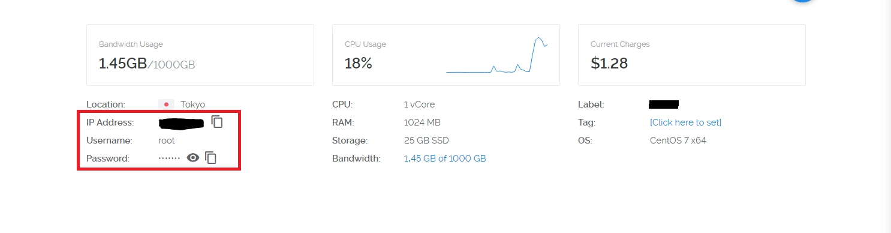

## 第二步：注册一个域名

域名就是别人访问你网站的"门牌号"。一个好记、有个性的域名能让人印象深刻，增加回头率。

**怎么选域名？**

- 好记：简短、朗朗上口
- 有个性：符合网站主题
- 不要太长：太长没人记得住

国内推荐在阿里云域名注册。在搜索框输入想要的域名和后缀，看看有没有被注册。

找到心仪的域名后，加入清单结算就行。

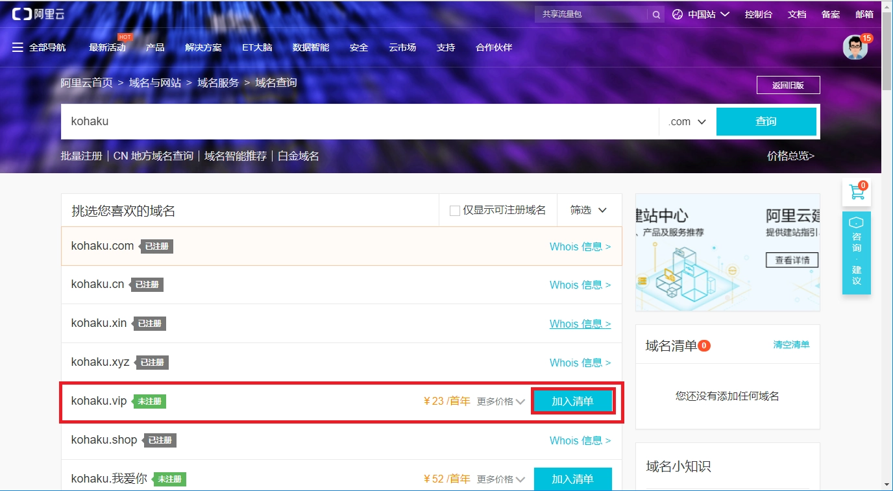

注册完成后，大部分域名需要实名认证，审核要几天时间。信息一定要填全、填准，不然可能被驳回。

## 第三步：把域名解析到云主机

域名注册好了，还需要"指路"——让域名指向你的云主机IP。

打开阿里云控制台，左边栏选择"域名"，找到刚注册的域名，点击"解析"。

可以选择新手指引，也可以自己填写解析记录。

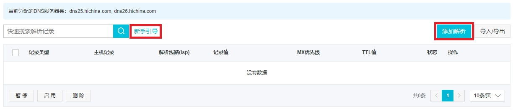

**填写主机记录的方法：**

- **www**：解析后访问 www.yourdomain.com
- **@**：直接解析主域名 yourdomain.com

记录值里填写云主机的IP地址。确认后大约一分钟生效。

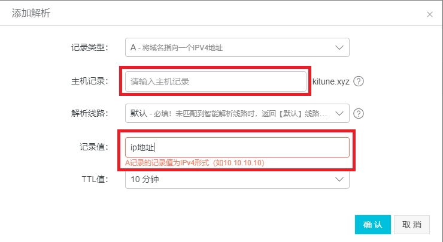

现在域名还访问不了，别急，还需要配置服务器。

## 第四步：连接上你的服务器

有了云主机，下一步就是连上它。我们用SSH来建立连接，这样就能远程输入命令、操作服务器了。

Vultr自带的SSH工具说实话挺难用，建议用专业的SSH软件。我用的是Xshell，免费、好用、功能强大。

去官网下载Xshell，选择"家庭/学校免费"版本，填写个人信息后会发下载链接到邮箱。下载可能有点慢，耐心等等。

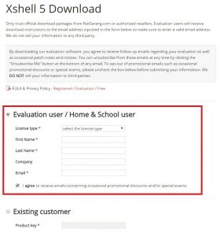

**配置Xshell连接**

安装好后打开Xshell，点击"新建会话"。

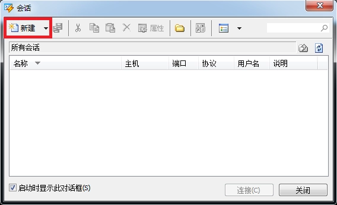

给服务器取个名字，填写云主机的IP地址。

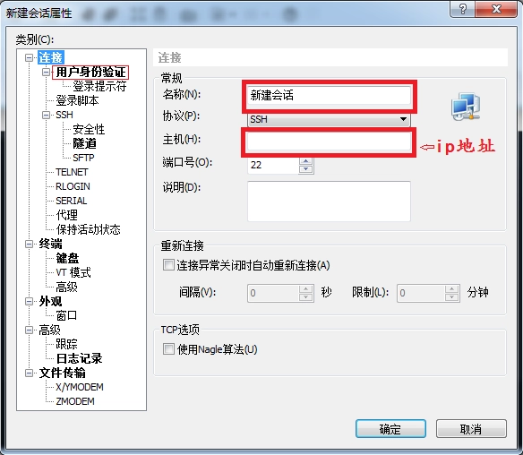

点击左边的"用户身份验证"，输入账号（一般是root）和密码（Vultr在服务器详情页能看到）。

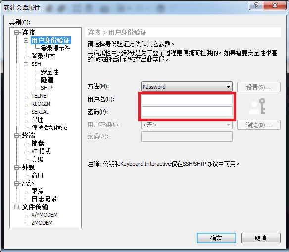

保存后，在列表里双击刚创建的服务器，就连上了。连接成功后，命令行会变色。

如果想让界面更好看，可以导入配色方案。我自己在用的配色，看着舒服，代码也清晰。

---

## 准备工作完成，接下来做什么？

现在你已经有了云主机、域名、SSH连接工具。准备工作全部完成。对于想快速部署的朋友，👉 [Vultr的云主机配置灵活，从基础套餐到高性能方案都有，按需选择很方便](https://www.vultr.com/?ref=9738262-9J)，后续的服务器环境搭建和WordPress安装会更顺畅。

下一篇教程会教你：
- 在服务器上安装Web环境（LNMP）
- 安装并配置WordPress
- 让你的博客正式上线

建站其实就是这样，一步一步来，没那么复杂。准备工作做扎实了,后面的操作就会很顺利。
